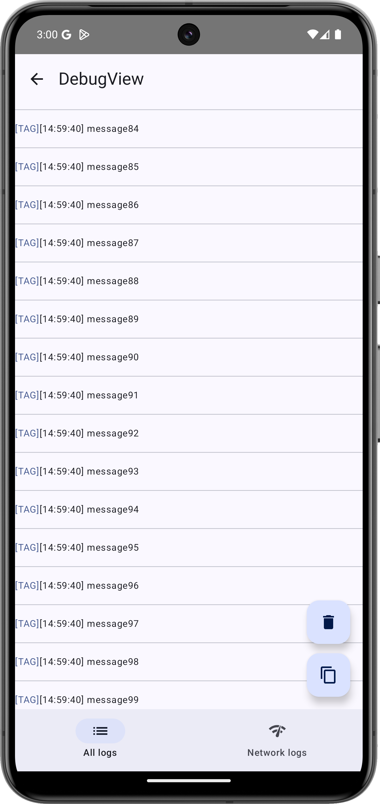
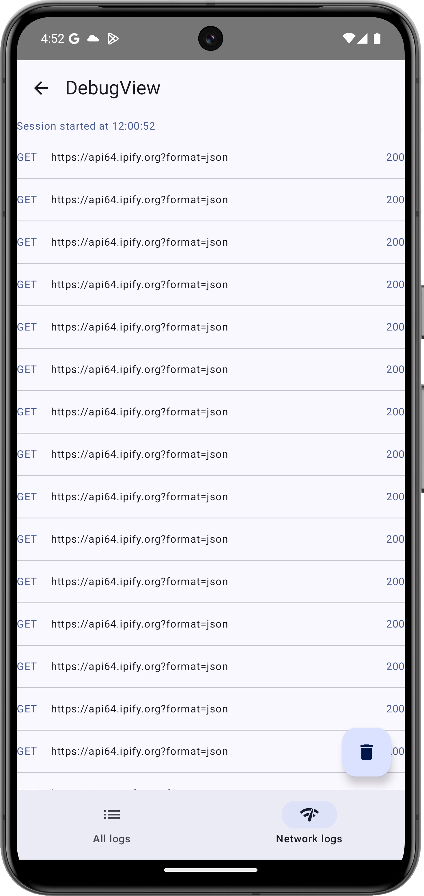
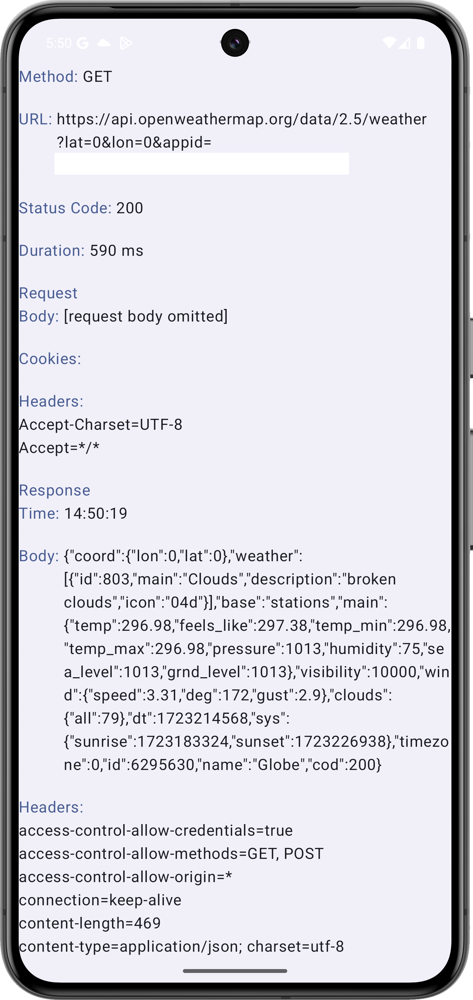
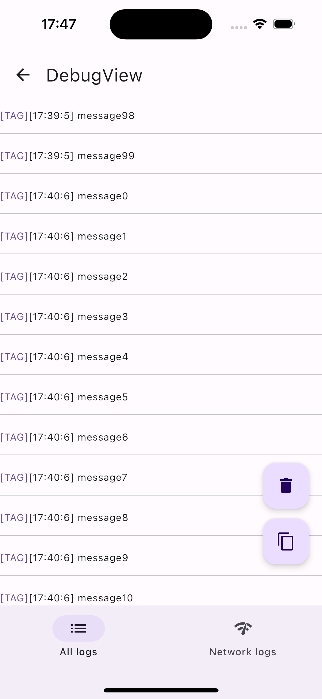
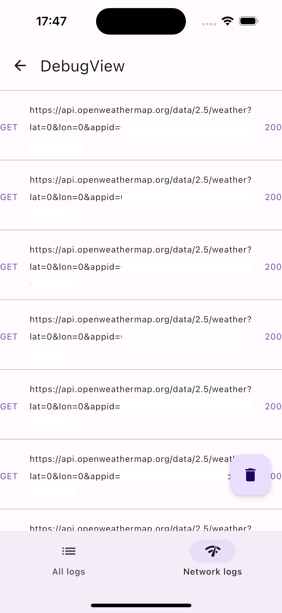
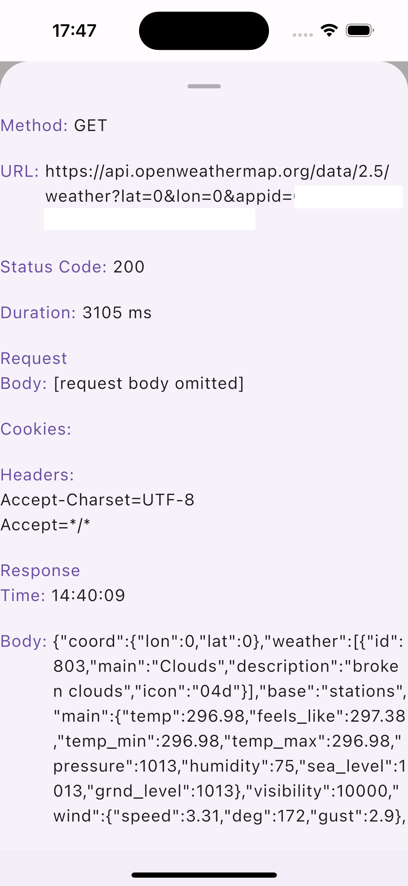

# LogKMPanion

[](https://maven-badges.herokuapp.com/maven-central/io.github.idfinance-oss/logkmpanion)

Welcome to **LogKMPanion**!
This Kotlin Multiplatform library is designed to help you observe and manage application logs
across Android and iOS platforms.
With a convenient Ktor plugin, LogKMPanion also allows you to monitor network
request logs effortlessly.

## Key features

- **Log Observation**: Seamlessly observe and manage logs from your application, enabling efficient
  debugging and analysis.
- **Ktor Plugin**: LogKMPanion includes a Ktor plugin that helps you observe network request logs in
  a streamlined and organized manner. Perfect for tracking and debugging network interactions.

## How to integrate?

1) Add the dependency

```kotlin
implementation("io.github.idfinance-oss:logkmpanion:$version")
```

2) To save log call

```Kotlin
fun addToLogKMPanion(type: LogType, tag: String, message: String)
```

3) To open log view:

- In Android:

  ```Kotlin
  fun openLogKMPanion(context: Context)
  ```

    - In iOS

        1) get the ViewController instance

      ```Swift
      fun LogKMPanionViewControllerProvider(onClose: () -> Unit): UIViewController
      ```

        2) display it

4) To display api calls:

   Add plugin to Ktor:

    ```Kotlin
    fun logKMPanionNetworkPlugin(sessionId: String = uuid4().toString()) //sessionId argument should be passed in case you have multiple http clients
    ```

## Preview

- Android





- iOS





## Technology stack

This project utilizes the following technologies:

- **Kotlin Multiplatform**: A feature of Kotlin that allows writing shared code across multiple platforms, including Android and iOS. 
- **Jetbrains Compose Multiplatform**: A declarative UI framework that enables building UIs for multiple platforms using Kotlin code. 
- **Decompose**: A state management library that provides a way to decompose complex UIs into smaller, manageable components. 
- **Realm**: A lightweight database for mobile applications, used for local data storage across different platforms.

## How to integrate the library only for debug builds?

The library also provides empty implementation (`logkmpanion-no-impl` module) with the same
interface (package name and method class names) as `logkmpanion` module.
So, u can implement `logkmpanion` module in debug builds and use `logkmpanion-no-impl` in release mode

```kotlin
implementation("io.github.idfinance-oss:logkmpanion-no-impl:$version")
```
