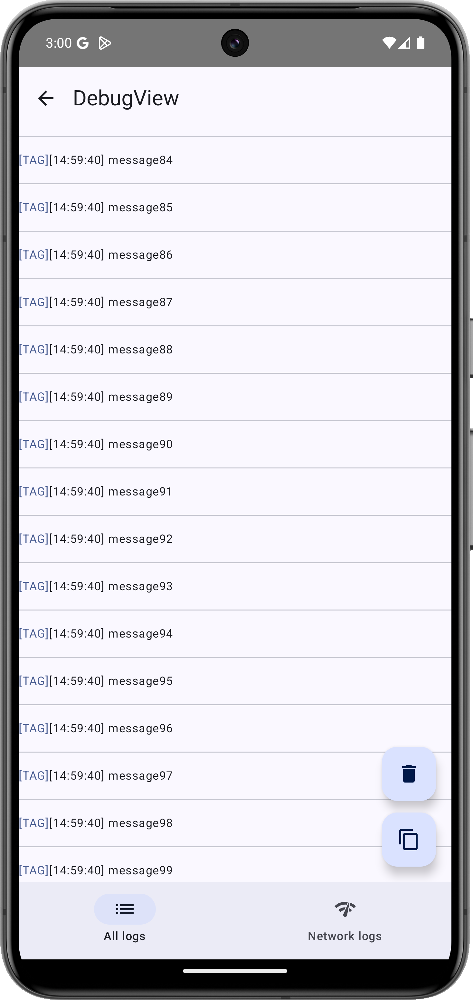
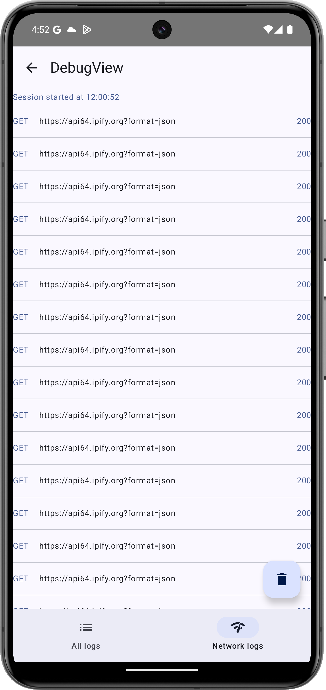
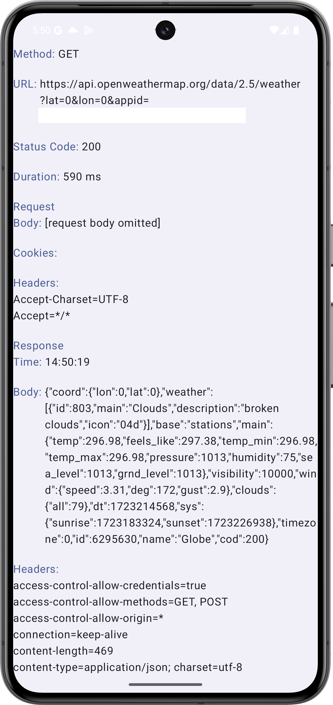
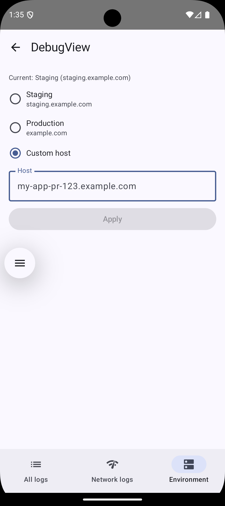
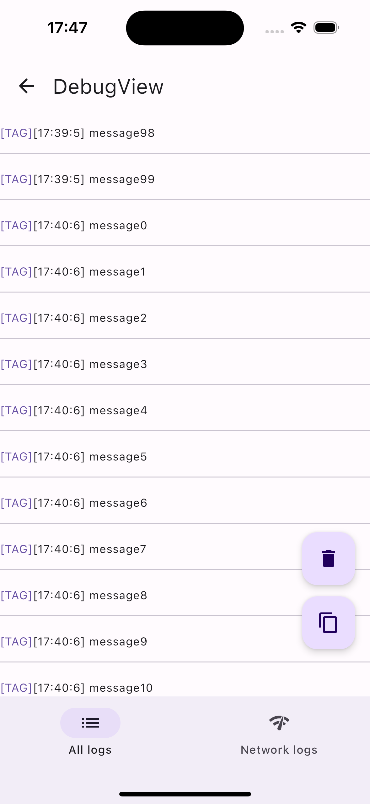
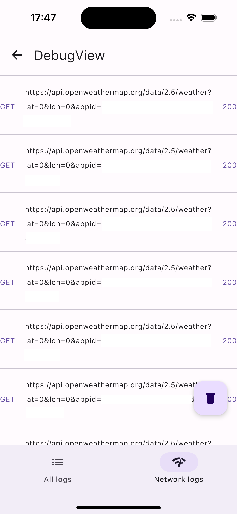
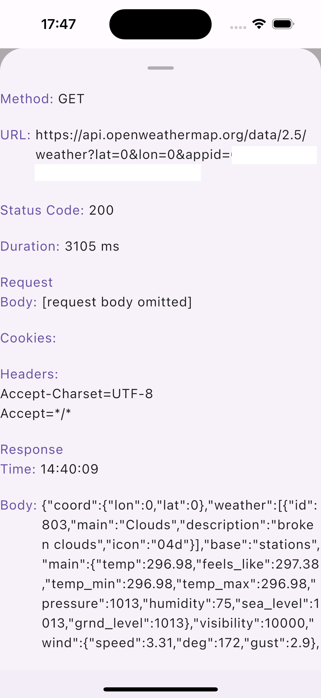

# LogKMPanion

[](https://img.shields.io/maven-central/v/io.github.idfinance-oss/logkmpanion)

Welcome to **LogKMPanion**!
This Kotlin Multiplatform library is designed to help you observe and manage application logs
across Android and iOS platforms.
With a convenient Ktor plugin, LogKMPanion also allows you to monitor network
request logs effortlessly.

## Key features

- **Log Observation**: Seamlessly observe and manage logs from your application, enabling efficient
  debugging and analysis.
- **Ktor Plugin**: LogKMPanion includes a Ktor plugin that helps you observe network request logs in
  a streamlined and organized manner. Perfect for tracking and debugging network interactions.
- **Environment Switcher**: An optional tab that lets QA and developers point the app at another
  backend host without rebuilding it. The app supplies the environments and applies the switch.

## How to integrate?

1) Add the dependency

```kotlin
implementation("io.github.idfinance-oss:logkmpanion:$version")
```

2) To save log call

```Kotlin
fun addToLogKMPanion(type: LogType, tag: String, message: String)
```

3) To open log view:

- In Android:

  ```Kotlin
  fun openLogKMPanion(context: Context)
  ```

    - In iOS

        1) add "<key>CADisableMinimumFrameDurationOnPhone</key><true/>" to project info.plist to fix the crash when opening the bottom sheet
        2) get the ViewController instance

      ```Swift
      fun LogKMPanionViewControllerProvider(onClose: () -> Unit): UIViewController
      ```

        2) display it

4) To display api calls:

   Add plugin to Ktor:

    ```Kotlin
    fun logKMPanionNetworkPlugin(sessionId: String = uuid4().toString()) //sessionId argument should be passed in case you have multiple http clients
    ```

## Environment switcher

The panel can also switch the app between backend environments. The library knows nothing about
hosts, storage or how a switch is applied: the app supplies an `EnvironmentProvider`, and the
**Environment** tab shows up only while one is registered.

```Kotlin
object AppEnvironmentProvider : EnvironmentProvider {

    override val environments = listOf(
        DebugEnvironment(id = "staging", title = "Staging", host = "staging.example.com"),
        DebugEnvironment(id = "production", title = "Production", host = "example.com"),
        // isHostEditable renders a text field, so an ad-hoc host such as a per-PR
        // review environment can be typed in
        DebugEnvironment(id = "custom", title = "Custom host", host = "", isHostEditable = true),
    )

    override val current: Flow<DebugEnvironment> = ...

    override suspend fun select(id: String, host: String?) {
        // persist the choice and rebuild the network stack;
        // most apps simply restart themselves here
    }
}
```

Register it once during startup, before the panel can be opened:

```Kotlin
LogKMPanion.setEnvironmentProvider(AppEnvironmentProvider)
```

Worth knowing:

- `host` is non-null only for entries with `isHostEditable` and carries the value the user typed.
- Persisting the selection is the app's job, the library stores nothing.
- Implement the provider in Kotlin. `current` is a `Flow`, which Swift cannot construct, so a
  Swift-only implementation is not possible.
- `select` may never return: an app that restarts its process to apply the switch dies inside it.
- Passing `null` removes the provider and hides the tab again.

## Preview

- Android






- iOS





## Technology stack

This project utilizes the following technologies:

- **Kotlin Multiplatform**: A feature of Kotlin that allows writing shared code across multiple platforms, including Android and iOS. 
- **Jetbrains Compose Multiplatform**: A declarative UI framework that enables building UIs for multiple platforms using Kotlin code. 
- **Decompose**: A state management library that provides a way to decompose complex UIs into smaller, manageable components. 
- **Realm**: A lightweight database for mobile applications, used for local data storage across different platforms.

## How to integrate the library only for debug builds?

The library also provides empty implementation (`logkmpanion-no-impl` module) with the same
interface (package name and method class names) as `logkmpanion` module.
So, u can implement `logkmpanion` module in debug builds and use `logkmpanion-no-impl` in release mode.
`EnvironmentProvider` and `DebugEnvironment` are part of that empty implementation too, so a provider
written by the app still compiles in release builds, where `setEnvironmentProvider` does nothing.

```kotlin
implementation("io.github.idfinance-oss:logkmpanion-no-impl:$version")
```
